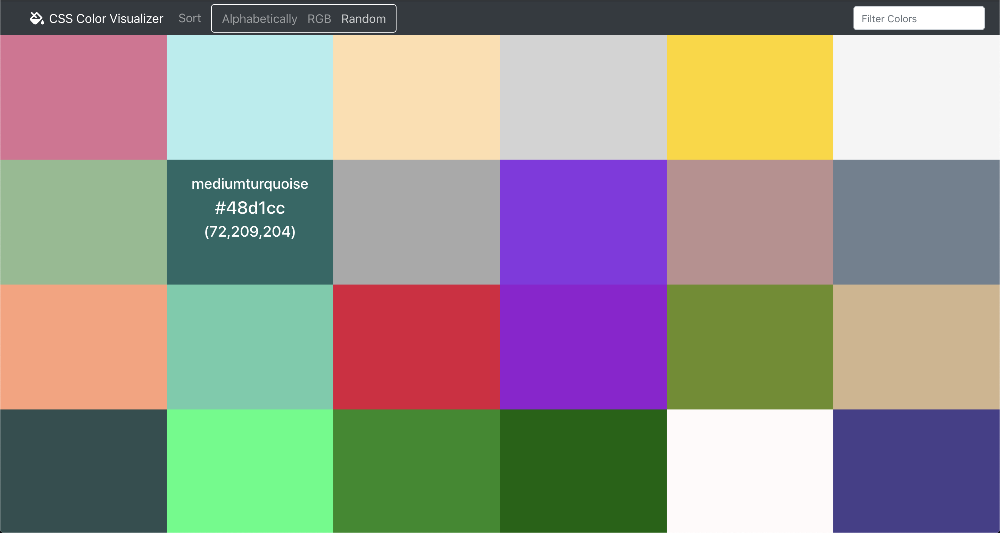

# CSS Color Visualizer

CSS Color Visualizer is a tool to help developers and designers visualize the 148 named CSS colors and see their hex and RGB codes.

Created with React

Try it out here! https://anhlin.github.io/css-color-visual

## Usage

Filter colors by typing a query (e.g. 'light', 'blue') in the search bar.
Sort colors lexically, by RGB code, or randomly by clicking the 'Sort' button and choosing an option.

